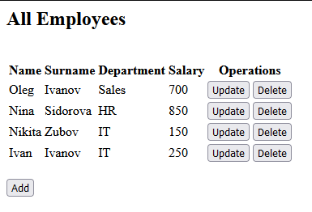
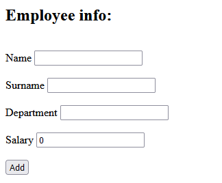
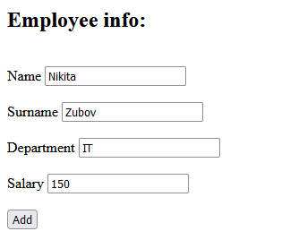
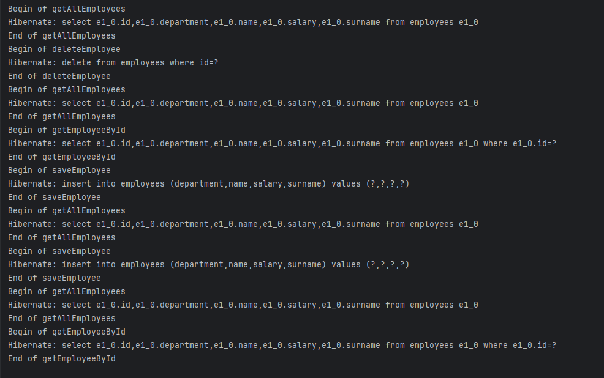

# SpringMVC_Hibernate_AOP

In this project, the following approach was used to create a web application:
- Creating a project and configuring the Tomcat server
- Using Spring MVC to implement an application using the Model — View — Controller architecture.
- Hibernate  for mapping objects to the relational database.
- c3p0 as connection pool.
- AspectJ for logging DAO methods (Simple logging to the console).
- JSP + JSTL to implement the View component.

Displaying a list of all employees with the ability to add, update and delete:

Adding a new employee:

Updating an existing employee:

Logging:

