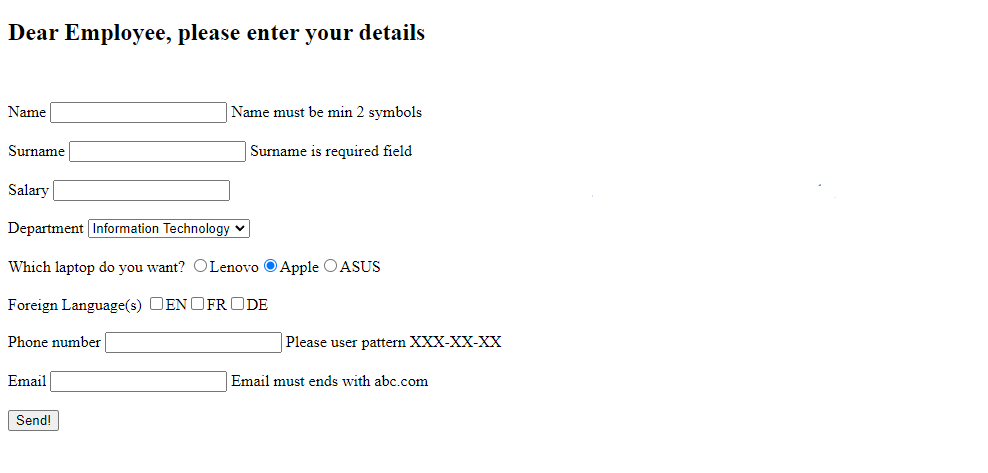
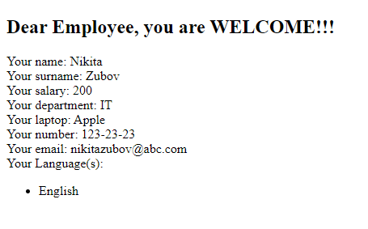

# Spring_MVC_Basics
In this project, the basics of Spring MVC were explored, namely:
- Project creation and Tomcat server configuration
- Using data in View
- Using the Model component
- Mapping with Controller
- Input forms
- Data validation

